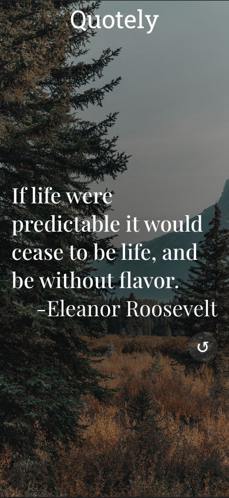
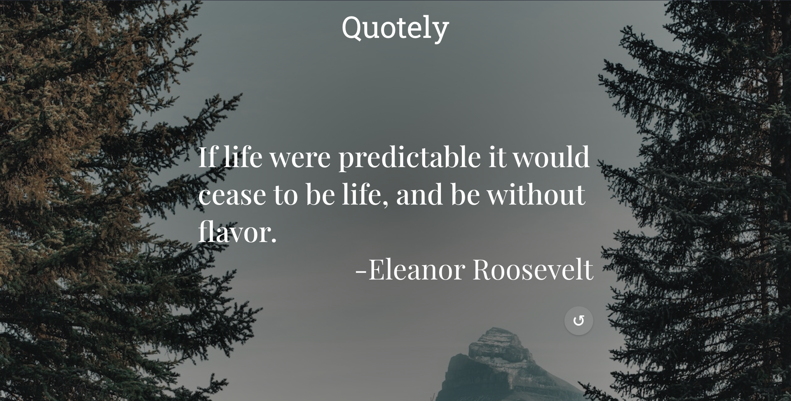

This project is a me having fun trying to build a react application.

The website generates random quotes on refresh and also allows the user to click a button to get a new quote.

The website has been optimized for mobile and desktop

The website can be accessed at [Quotely.com](https://bevanlewis.github.io/Quotely/) 

Project built using 

Mobile Version

Desktop Version

